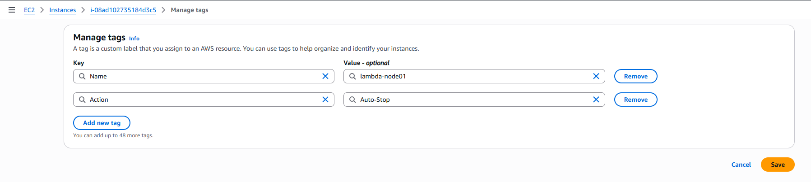
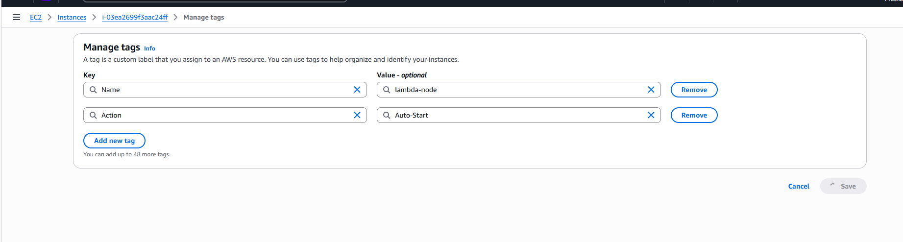
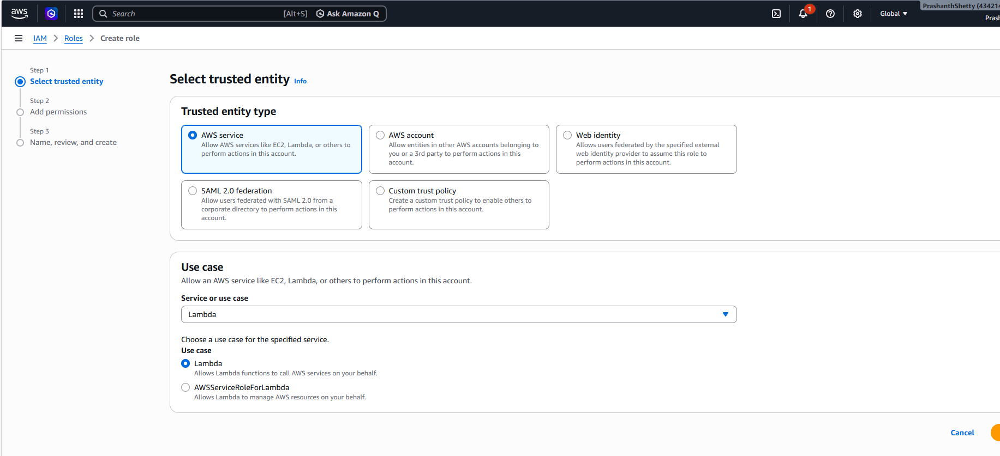
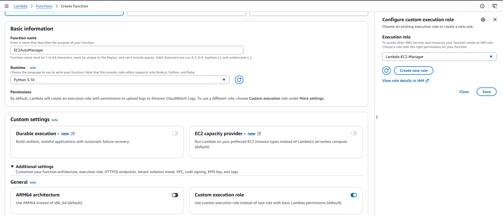
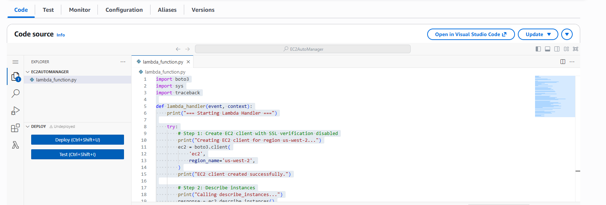
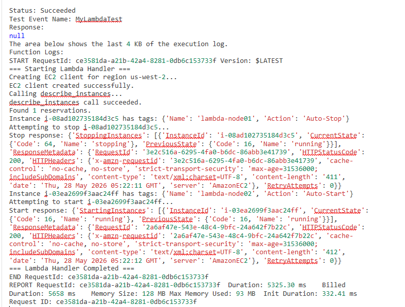

# AWS Lambda EC2 Automation

## 📌 Overview
This project shows how to automatically **start** or **stop** EC2 instances using an AWS Lambda function based on custom tags.  
Instances tagged with `Action=Auto-Stop` will be stopped, instances tagged with `Action=Auto-Start` will be started.

---

## ⚙️ Prerequisites
- AWS account with access to EC2 and Lambda.
- IAM role with permissions:
  - `AmazonEC2FullAccess`
- Python 3.10 runtime for Lambda.

---

## 🛠 Steps Taken

### 1. Tagging EC2 Instances
- Added tags to instances:
  - `lambda-node01` → `Action=Auto-Stop`
  - `lambda-node02` → `Action=Auto-Start`

### 2. IAM Role Setup
- Created a role named **Lambda-EC2-Manager**.
- Attached the **AmazonEC2FullAccess** policy for simplicity (can be restricted to only required actions).

### 3. Lambda Function Creation
- Created a Lambda function named **EC2AutoManager**.
- Runtime: Python 3.9.
- Timeout: **30 seconds** (default 3 seconds was too short).
- Memory: 128 MB.

### 4. Lambda Function Code
Lambda code was placed in the code section, deployed and test was performed.

### 5. Lambda Function Testing

