# AWS Lambda S3 Bucket Cleanup

## 📌 Overview
This project demonstrates how to use an AWS Lambda function with **Boto3** to automatically clean up old files in an S3 bucket.  
Objects older than **30 days** are deleted, while newer files remain untouched.

---

## ⚙️ Prerequisites
- AWS account with access to S3 and Lambda.
- IAM role with permissions:
  - `s3:ListBucket`
  - `s3:DeleteObject`
- Python 3.9 or 3.10 runtime for Lambda.
- An S3 bucket with test files uploaded.

---

## 🛠 Steps Taken

### 1. S3 Bucket Setup
- Created a new bucket: `lambda-s3-cleanup-demo`.

#### Creating bucket
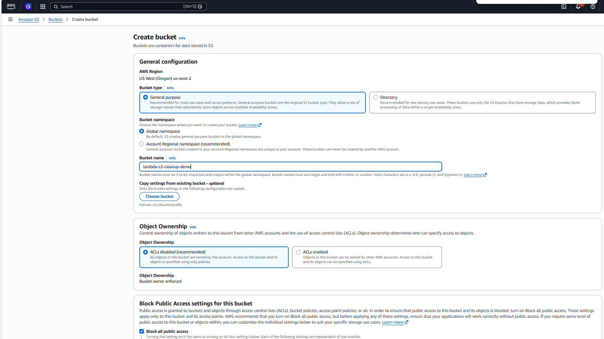

### Data uploaded to bucket
- Uploaded multiple files (PDFs, text files).
- Verified that all files show **Last modified** timestamps at upload time.
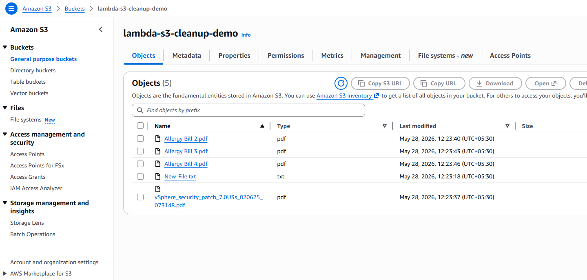

### 2. IAM Role Setup
- Created IAM role named **Lambda-S3-Cleanup**.
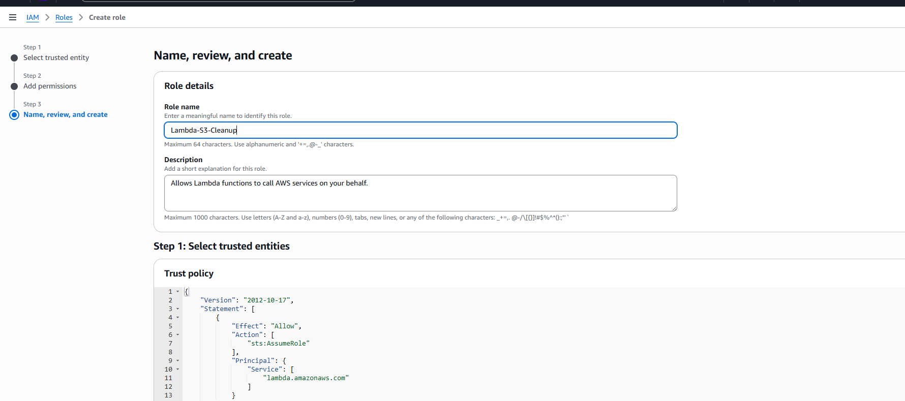

- Trusted entity: **Lambda**.
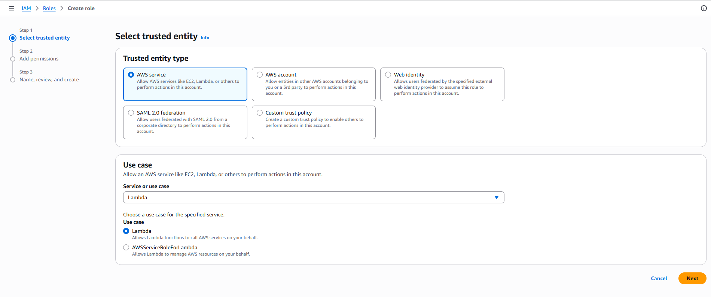

- Attached policy: **AmazonS3FullAccess** (for simplicity; in production, restrict to only required actions).
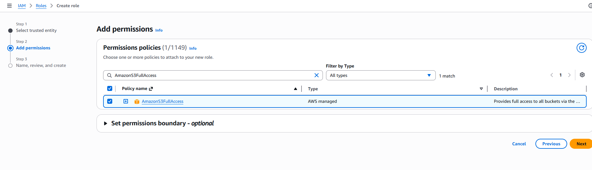

- IAM Role created successfully
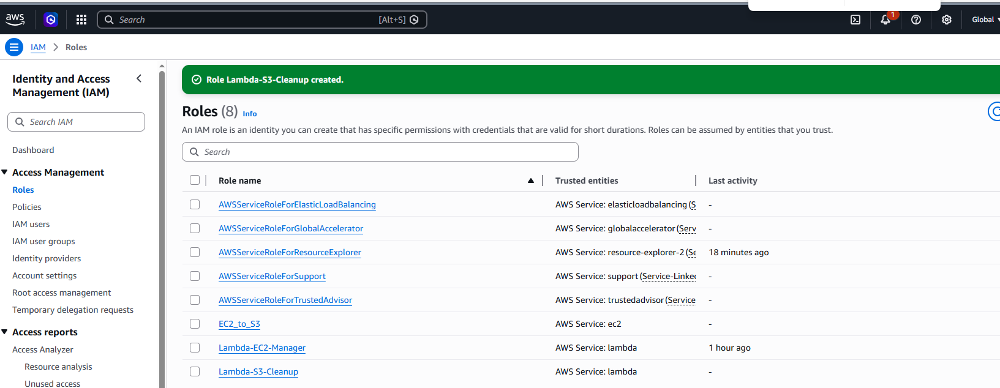

### 3. Lambda Function Creation
- Created Lambda function named **S3CleanupFunction**.
- Runtime: Python 3.9.
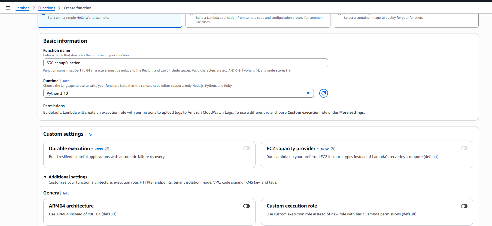

- Timeout: **30 seconds**.
- Memory: 128 MB.

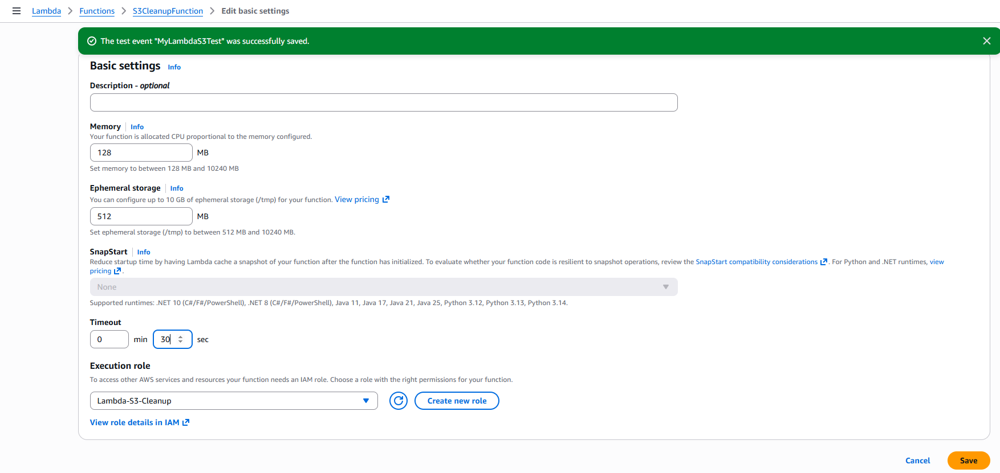

- Execution role: **Lambda-S3-Cleanup**.
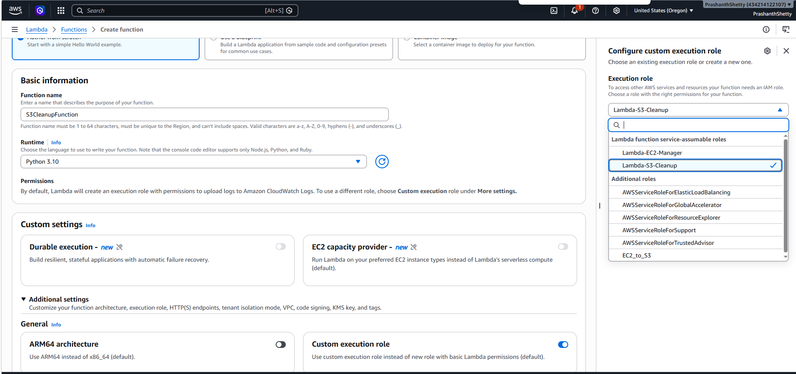

### 4. Lambda Function Code
Code has been added.

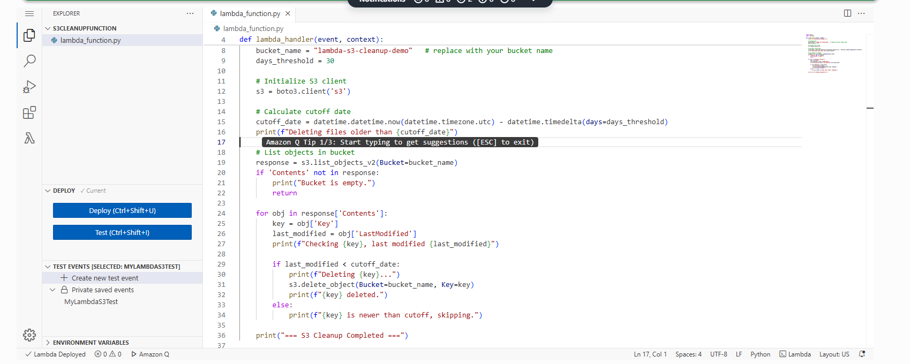

### 5. Lambda Function Test Code
Create lambda test case as below.

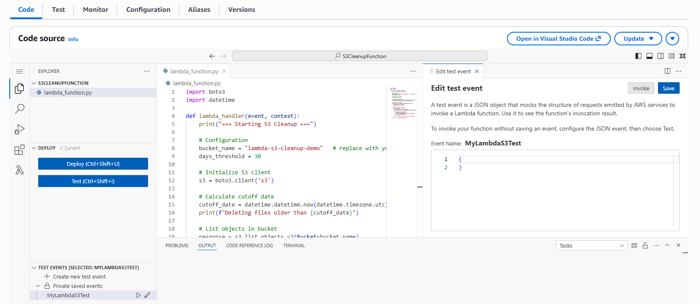

### 6. Lambda Function Test Result

Executed the code and the result should be as below.

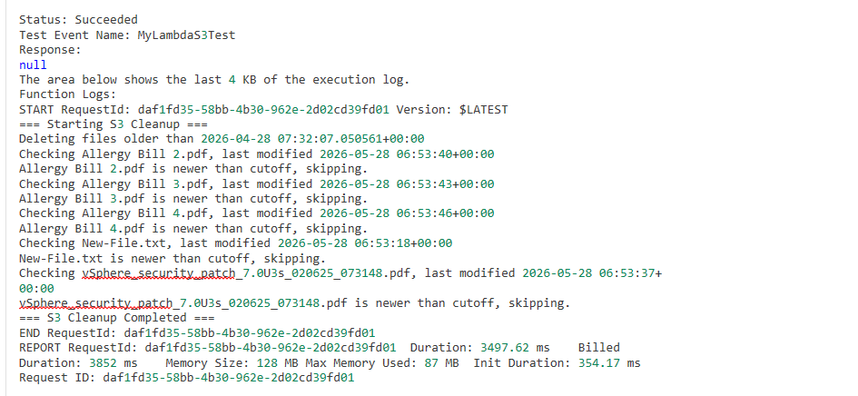

