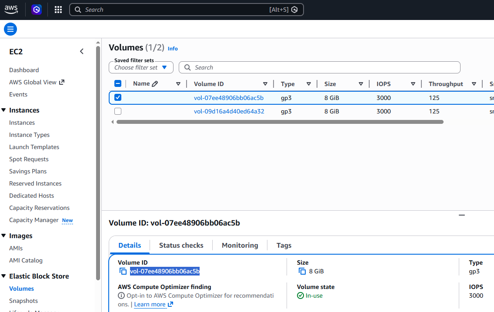
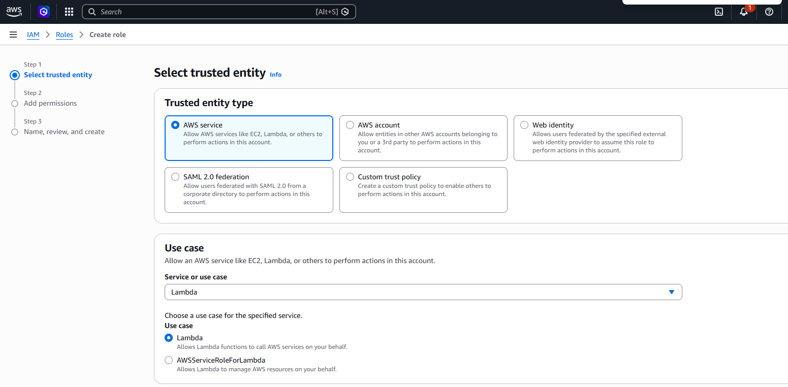
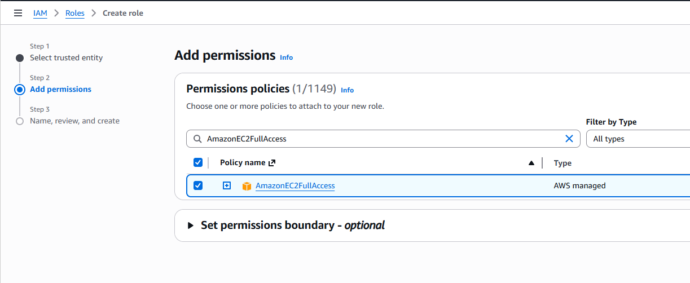
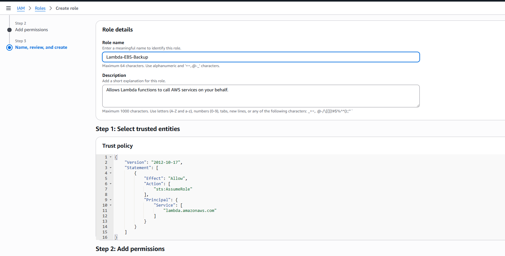
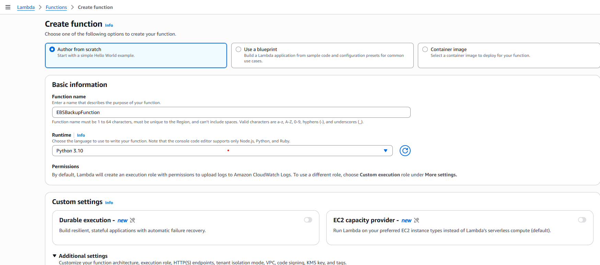
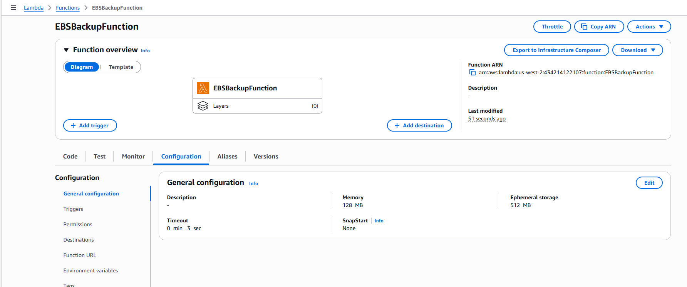
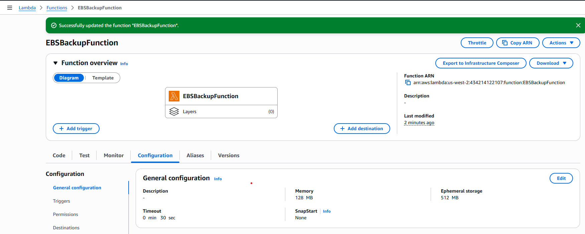
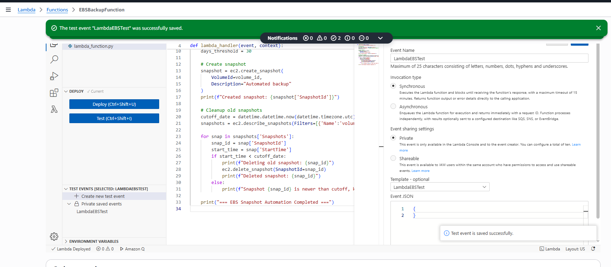
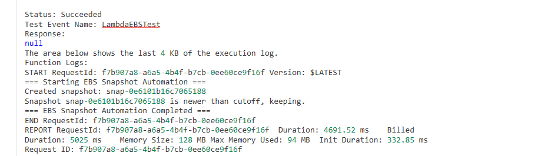
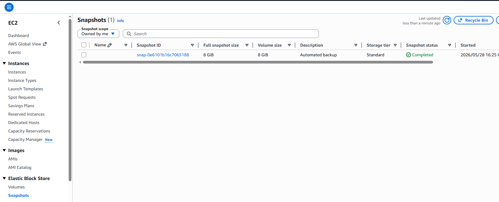

# AWS Lambda EBS Snapshot Automation

## 📌 Overview
This project demonstrates how to use AWS Lambda with **Boto3** to automatically create snapshots of EBS volumes and clean up old snapshots beyond a retention period (30 days).  
The goal is to ensure regular backups while controlling storage costs.

---

## ⚙️ Prerequisites
- AWS account with access to EC2 and Lambda.
- IAM role with permissions:
  - `ec2:CreateSnapshot`
  - `ec2:DescribeSnapshots`
  - `ec2:DeleteSnapshot`
- Python 3.9 or 3.10 runtime for Lambda.
- At least one EBS volume available.

---

## 🛠 Steps Taken

### 1. EBS Setup
- Navigated to **EC2 dashboard → Volumes**.
- Identified the target EBS volume for backup.
- Noted down the **Volume ID** (e.g., `vol-xxxxxxxx`), in our case the Volume ID is vol-07ee48906bb06ac5b.

    

### 2. IAM Role Setup
- Initiate creation of IAM role named **Lambda-EBS-Backup**.
- Trusted entity: **Lambda**.

- Attached policy: **AmazonEC2FullAccess** (for simplicity; in production, restrict to snapshot‑related actions).

- Create IAM role 



### 3. Lambda Function Creation
- Created Lambda function named **EBSBackupFunction**.
- Runtime: Python 3.9.

    

- Memory: 128 MB.
- Timeout: **30 seconds** modified from **3 seconds**
    

    TO 

    
- Execution role: **Lambda-EBS-Backup**.

### 4. Lambda Function Created

Function is now being created along with a test case.

    

```python
import boto3
import datetime

def lambda_handler(event, context):
    print("=== Starting EBS Snapshot Automation ===")

    # Configuration
    ec2 = boto3.client('ec2', region_name='us-west-2')
    volume_id = "vol-xxxxxxxx"  # replace with your volume ID
    days_threshold = 30

    # Create snapshot
    snapshot = ec2.create_snapshot(
        VolumeId=volume_id,
        Description="Automated backup"
    )
    print(f"Created snapshot: {snapshot['SnapshotId']}")

    # Cleanup old snapshots
    cutoff_date = datetime.datetime.now(datetime.timezone.utc) - datetime.timedelta(days=days_threshold)
    snapshots = ec2.describe_snapshots(Filters=[{'Name':'volume-id','Values':[volume_id]}])

    for snap in snapshots['Snapshots']:
        snap_id = snap['SnapshotId']
        start_time = snap['StartTime']
        if start_time < cutoff_date:
            print(f"Deleting old snapshot: {snap_id}")
            ec2.delete_snapshot(SnapshotId=snap_id)
            print(f"Deleted snapshot: {snap_id}")
        else:
            print(f"Snapshot {snap_id} is newer than cutoff, keeping.")

    print("=== EBS Snapshot Automation Completed ===")
```
### 5. Lambda Function Tested

The test case created will be executed to ensure code is working as expected.



### 6. Snapshot created using lambda function successfully

Screenshot confirms that this code works and snapshot is created with latest timestamp.

