# AWS Lambda Billing Alert Automation

## 📌 Overview
This project demonstrates how to use AWS Lambda with **Boto3** and **SNS** to automatically monitor AWS billing and send alerts when costs exceed a specified threshold.  
The goal is to provide proactive notifications to avoid unexpected charges.

---

## ⚙️ Prerequisites
- AWS account with access to CloudWatch, Lambda, and SNS.
- IAM role with permissions:
  - `cloudwatch:GetMetricStatistics`
  - `sns:Publish`
- Python 3.9 or 3.10 runtime for Lambda.
- An SNS topic with an email subscription.

---

## 🛠 Steps Taken

### 1. SNS Setup
- Navigated to the **SNS dashboard**.  
  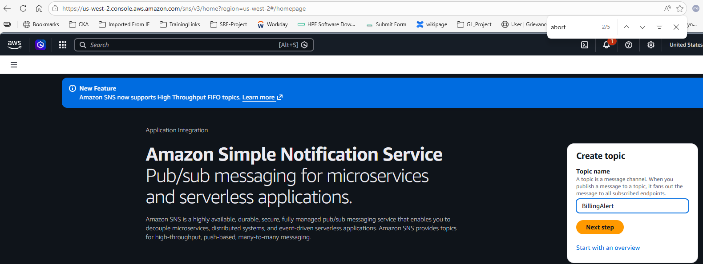

- Created a new topic named **BillingAlert**.  
  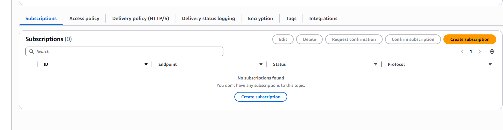

- Subscribed an email address to the topic.  
  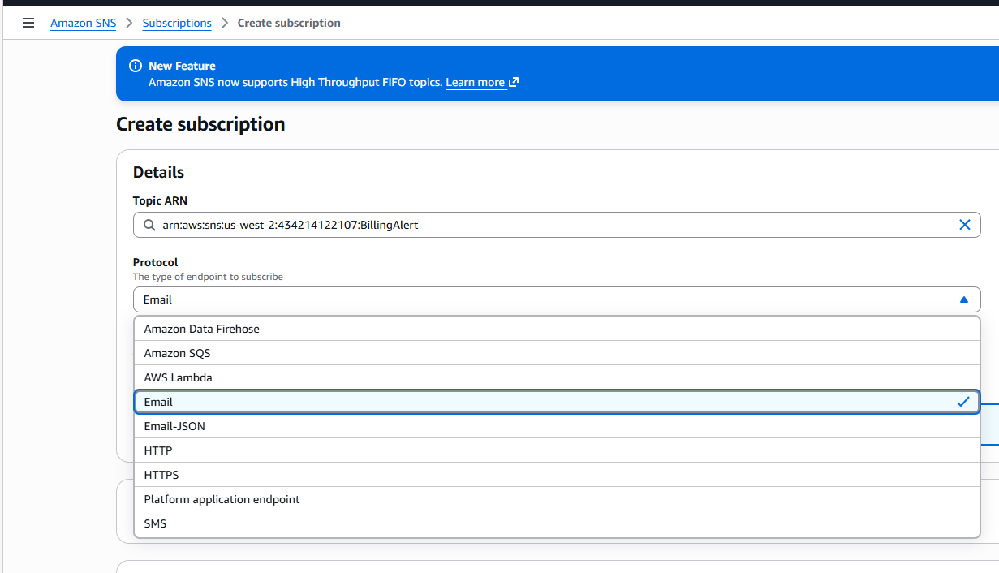  
  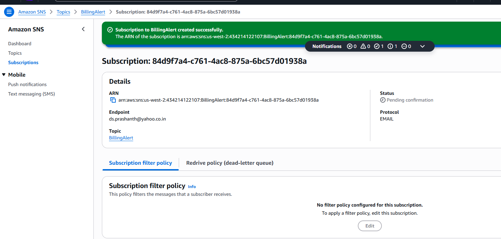

- Verified subscription via confirmation email.  
  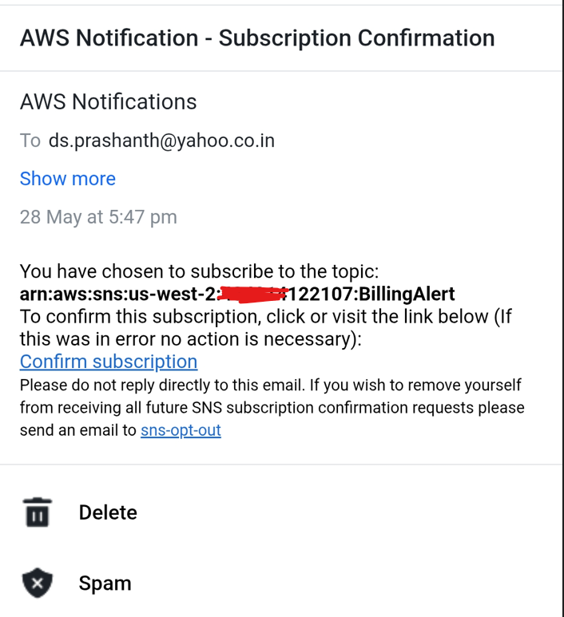  
  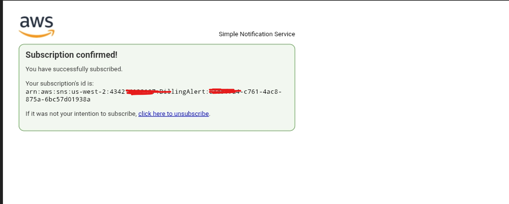  
  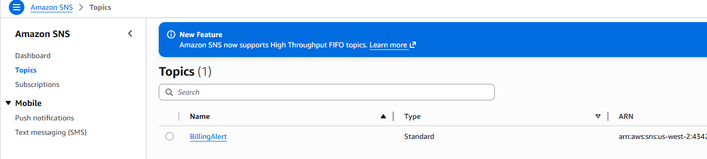  
  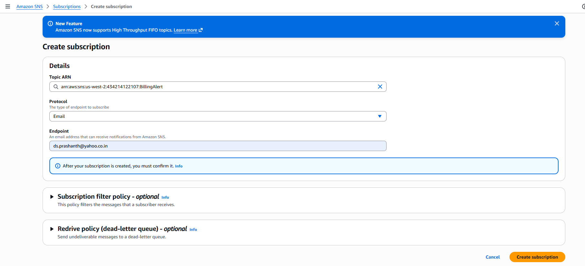

---

### 2. IAM Role Setup
- Created IAM role named **Lambda-Billing-Alert**.  
  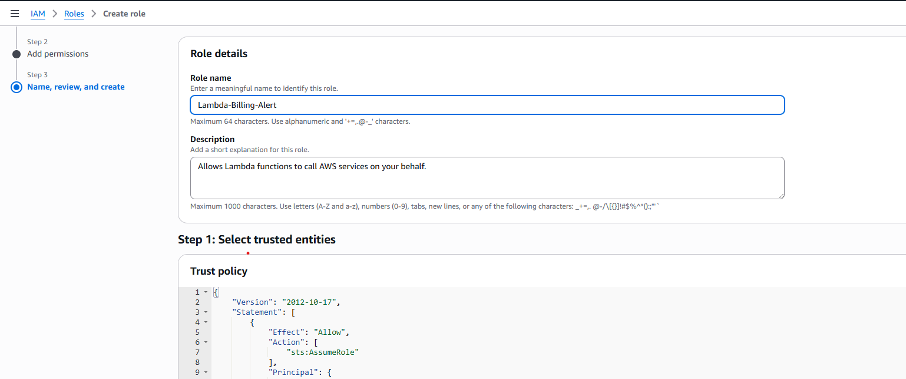  
  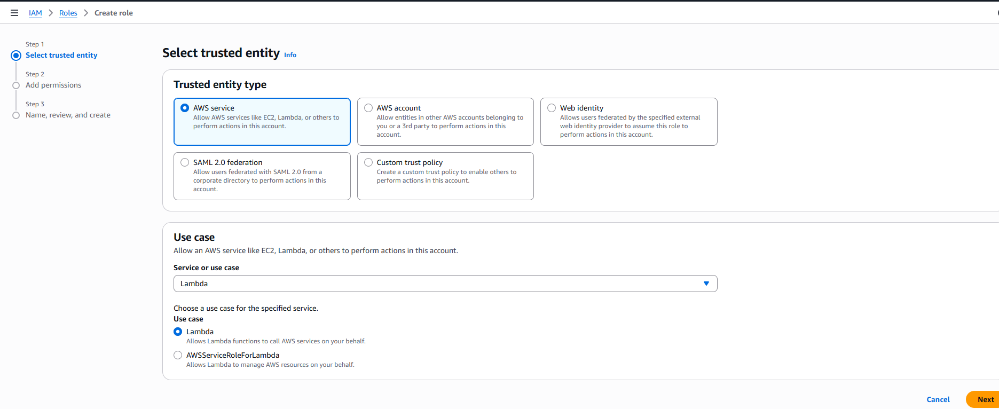

- Attached policies:
  - **CloudWatchReadOnlyAccess**  
  - **AmazonSNSFullAccess**  
  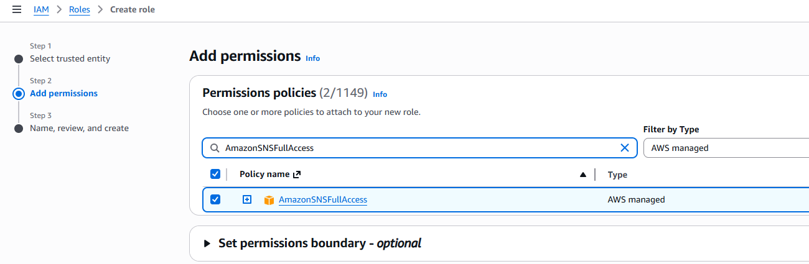  
  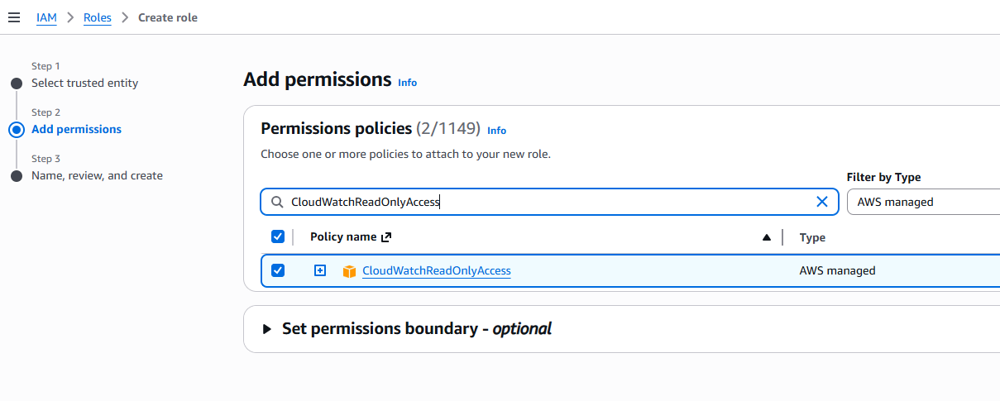

---

### 3. Lambda Function Creation
- Created Lambda function named **BillingAlertFunction**.  
  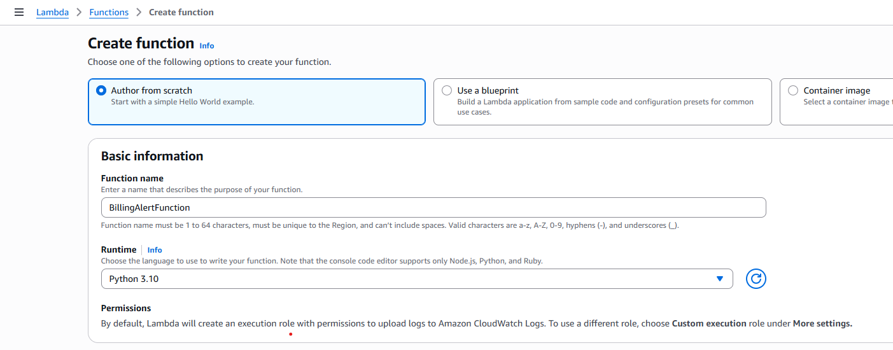

- Configured timeout and execution role.  
  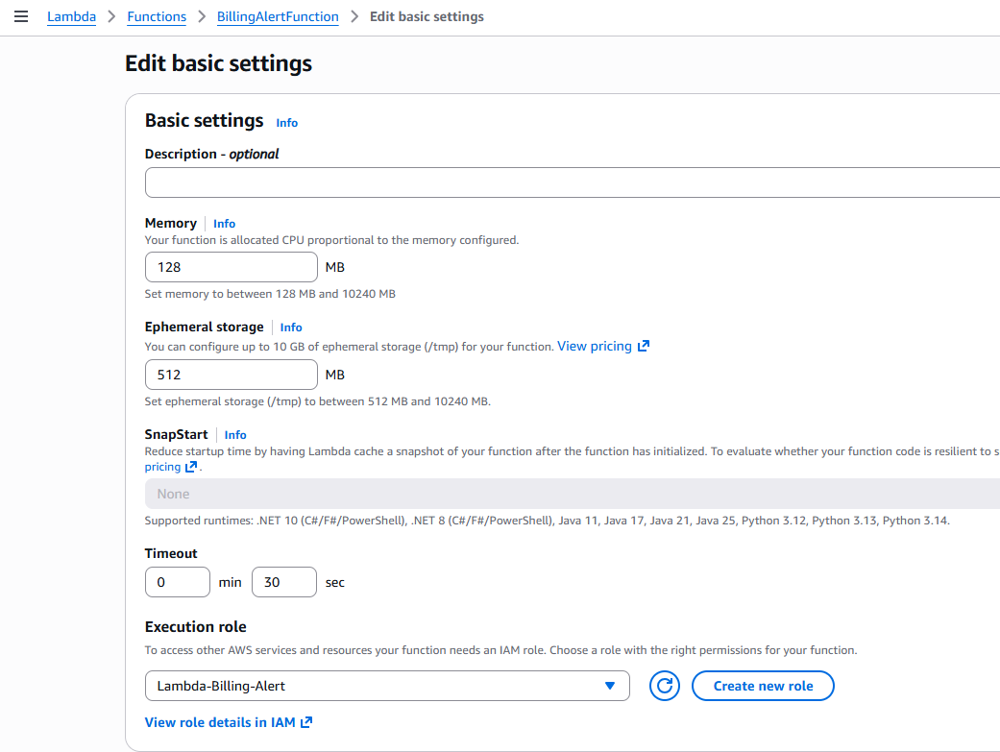

- Deployed the Python code.  
  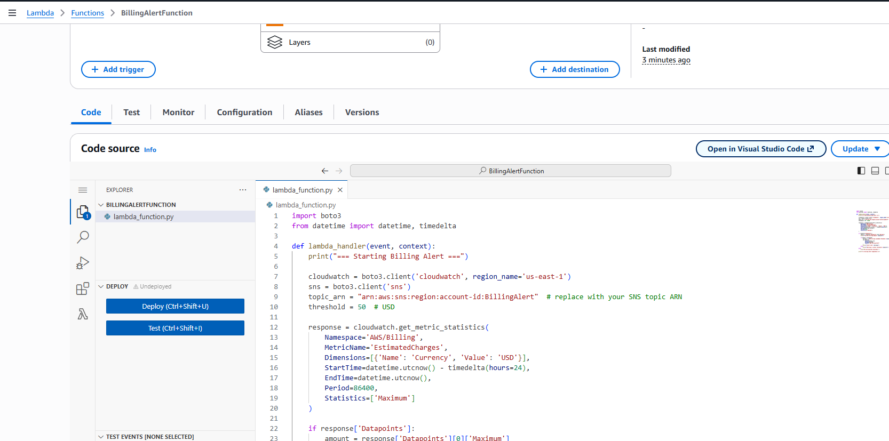

---

### 4. Lambda Function Code
```python
import boto3
from datetime import datetime, timedelta

def lambda_handler(event, context):
    print("=== Starting Billing Alert ===")

    cloudwatch = boto3.client('cloudwatch', region_name='us-east-1')
    sns = boto3.client('sns')
    topic_arn = "arn:aws:sns:region:account-id:BillingAlert"  # replace with your SNS topic ARN
    threshold = 50  # USD

    response = cloudwatch.get_metric_statistics(
        Namespace='AWS/Billing',
        MetricName='EstimatedCharges',
        Dimensions=[{'Name': 'Currency', 'Value': 'USD'}],
        StartTime=datetime.utcnow() - timedelta(hours=24),
        EndTime=datetime.utcnow(),
        Period=86400,
        Statistics=['Maximum']
    )

    if response['Datapoints']:
        amount = response['Datapoints'][0]['Maximum']
        print(f"Current billing amount: ${amount}")

        if amount > threshold:
            message = f"AWS billing exceeded threshold: ${amount}"
            sns.publish(
                TopicArn=topic_arn,
                Message=message,
                Subject="AWS Billing Alert"
            )
            print(f"Alert sent: {message}")
        else:
            print(f"Billing is within threshold: ${amount}")
    else:
        print("No billing data available.")

    print("=== Billing Alert Completed ===")
```
---
### 5. Lambda Function Code Testing

Create a test code to check if the function succeeds.

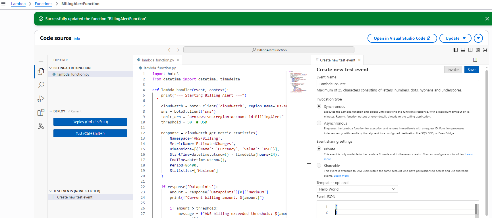
---
### 6. Lambda Function Code Testing Results

If the function executes successfully you should see the following message.

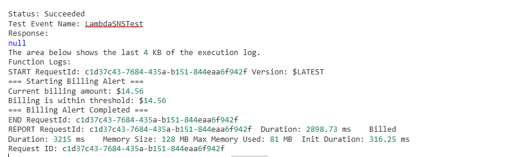